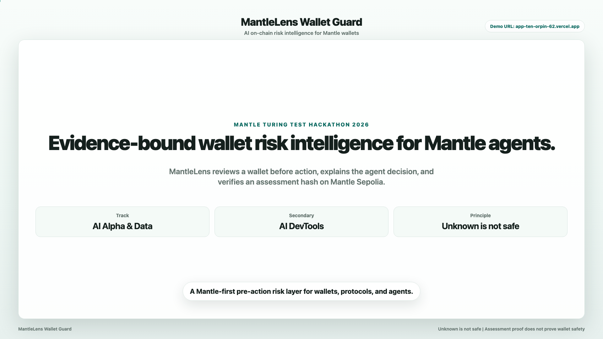

# MantleLens Wallet Guard

Mantle-first AI wallet risk intelligence agent, built on an adapter-ready EVM risk engine.

## Live Demo in 60 Seconds

- [Watch the demo video in browser](https://app-ten-orpin-62.vercel.app/demo-video/)
- [Open the WebM file directly](https://app-ten-orpin-62.vercel.app/demo-video/mantlelens_demo.webm)
- Proof tx: [Mantlescan AssessmentRecorded transaction](https://sepolia.mantlescan.xyz/tx/0x00caf7c1017fd8a692cd166f6d69c12c530a415f375f9cd0c66010b270e1d369)

Manual proof check:

1. Open: [https://app-ten-orpin-62.vercel.app](https://app-ten-orpin-62.vercel.app)
2. Select: `Live scan`
3. Click: `Use Sepolia sample wallet`
4. Scan wallet
5. Open `Evidence`
6. Click `View on-chain proof`
7. Confirm:
   - Event: `AssessmentRecorded`
   - Verification: `matched`
   - Chain: `Mantle Sepolia · 5003`
   - Contract: `AssessmentLogger`
   - Tx: [https://sepolia.mantlescan.xyz/tx/0x00caf7c1017fd8a692cd166f6d69c12c530a415f375f9cd0c66010b270e1d369](https://sepolia.mantlescan.xyz/tx/0x00caf7c1017fd8a692cd166f6d69c12c530a415f375f9cd0c66010b270e1d369)

## Canonical Demo Facts

| Item | Value |
| --- | --- |
| Network | Mantle Sepolia · chainId 5003 |
| Frontend | [https://app-ten-orpin-62.vercel.app](https://app-ten-orpin-62.vercel.app) |
| Backend API | [https://mantlelens-wallet-guard-production.up.railway.app](https://mantlelens-wallet-guard-production.up.railway.app) |
| Demo wallet | `0xc70e1953e3473666182a875e660be7bc911ae459` |
| Demo token | MLDT Sepolia test token |
| MLDT token contract | `0xb5600dccf7f95ff7e52f67fee192921d0eeb3a56` |
| AssessmentLogger | `0x88507ca2ebcf3c3469fbd6b1085b01b6c147c06c` |
| Verified assessment tx | `0x00caf7c1017fd8a692cd166f6d69c12c530a415f375f9cd0c66010b270e1d369` |
| Event | `AssessmentRecorded` |
| Known assessment hash for the frozen demo proof | `0xbca30db3a6348665908834af5c9f31a066fee6dfaac0eaa6cfd8bd4a252a5bec` |
| Verification status | `matched` |

If a newly generated live assessment hash differs, the UI should show the current assessment as not recorded and the previous verified assessment as available.

[](https://app-ten-orpin-62.vercel.app/demo-video/)

## What the Proof Proves / Does Not Prove

Assessment hash proves the assessment record, not wallet safety.

Proof proves:

- An assessment hash was recorded on Mantle Sepolia.
- The on-chain `AssessmentRecorded` event can be read back.
- The recorded hash can be verified against the local assessment hash.
- The proof is linked to Mantle Sepolia chainId `5003` and the `AssessmentLogger` contract.

Proof does not prove:

- The wallet is safe.
- The scan is exhaustive.
- All historical approvals or transfers were discovered.
- Funds were moved.
- Risk was removed.
- A real revoke, swap, or transfer was executed.

## Public Deployment Safety

The public deployment is read-only by default:

- It can run read-only live wallet scans.
- It can verify the pre-recorded Mantle Sepolia assessment transaction.
- It does not hold private keys.
- It does not store seed phrases.
- It does not create server-signed on-chain records.
- It does not automatically connect wallets.
- It does not automatically broadcast transactions.

New assessment records require explicit wallet confirmation in a local/manual wallet flow.

## MLDT Test Token Disclaimer

MLDT is a Sepolia test token used only for the MantleLens demo flow.

- It has no market value.
- It is not official mETH, cmETH, USDY, or mUSD.
- Any `priceUsd` value used in the demo allowlist is a demo-only placeholder for risk scoring and UI testing.
- It is not a live market quote.

## Tracks Applied

Primary: AI Alpha & Data

Reason: MantleLens detects on-chain wallet risk signals, transfer anomalies, source coverage gaps, and evidence-bound assessment records.

Secondary: AI DevTools

Reason: MantleLens exposes an evidence-bound risk assessment workflow, proof verification, MCP-style tools, and integration paths for wallets, protocols, and agents.

AI x RWA / yield exposure is treated only as Mantle-native signal context, not the main track narrative.

## What MantleLens Does

MantleLens is a pre-action wallet risk assessment layer. Before a user, wallet, protocol, or agent takes action, MantleLens can scan a public wallet address and return:

- evidence-bound risk signals
- active allowance and transfer evidence when available
- suspicious transfer / address poisoning candidates
- Mantle-native token and yield-like exposure context
- source coverage warnings when indexed data is incomplete
- a deterministic agent decision and safe next step
- a verifiable assessment hash proof on Mantle Sepolia

Core principle:

> Unknown is not safe.

If indexed balances, approval history, transfer history, or spender labels are unavailable, MantleLens marks that state as partial / unknown instead of treating the wallet as safe.

## Why Mantle

MantleLens is Mantle-first for the hackathon, with an adapter-ready EVM architecture underneath.

- Mantle Sepolia live scan target, chainId `5003`
- Mantle Mainnet `5000` visible as the production target path
- Mantle RPC read-only wallet scan
- Mantle known-token allowlist
- MLDT labeled as a Sepolia test token, not an official Mantle yield asset
- Mantle Sepolia `AssessmentLogger`
- Mantlescan links for tx, contract, and proof verification

This keeps the demo Mantle-native without overstating broad multi-chain support.

## Agent Decision Loop

1. Observe wallet data
2. Bind risk claims to evidence
3. Apply deterministic rules before explanation
4. Produce a decision and safe next step
5. Show allowed and blocked actions
6. Simulate safer actions only when evidence supports them
7. Record and verify an assessment hash on Mantle

LLM-style explanation is constrained by evidence and hard rules. It cannot mark unknown data as safe, override hard rules, or execute transactions.

For full audit details, see [docs/P2_7B_AGENT_DECISION_AUDIT.md](docs/P2_7B_AGENT_DECISION_AUDIT.md).

## Safety Boundaries

MantleLens does not:

- custody private keys
- handle seed phrases
- automatically connect wallets
- automatically broadcast transactions
- execute real revoke in the default demo path
- execute swap, trade, transfer, or auto-signing
- provide investment advice
- promise that a wallet is safe
- claim that a scan is exhaustive when indexed sources are partial

## Local Setup

### 1. Install frontend dependencies

```bash
cd frontend/app
npm install
```

### 2. Configure environment

From the repository root:

```bash
cp .env.example .env
chmod 600 .env
```

Fill only the variables you need. Never commit `.env`.

### 3. Start backend

From the repository root:

```bash
./scripts/run_demo.sh
```

Backend:

```text
http://127.0.0.1:8765
```

### 4. Start frontend

In a second terminal:

```bash
./scripts/run_app.sh
```

Frontend:

```text
http://127.0.0.1:5173
```

### 5. Run the demo wallet locally

1. Open `http://127.0.0.1:5173`.
2. Select `Live scan`.
3. Click `Use Sepolia sample wallet`, or paste:

```text
0xc70e1953e3473666182a875e660be7bc911ae459
```

4. Click `Scan wallet`.
5. Open `Evidence`.
6. Click `View on-chain proof`.
7. Confirm `AssessmentRecorded`, `matched`, `Mantle Sepolia · 5003`, and the Mantlescan tx link.

## Environment Variables

Required for live Mantle Sepolia read-only scan:

```bash
MANTLE_CHAIN_ID=5003
CHAIN_ID=5003
MANTLE_RPC_URL=https://rpc.sepolia.mantle.xyz
MANTLE_EXPLORER_BASE_URL=https://sepolia.mantlescan.xyz
```

Known demo token allowlist:

```bash
MANTLE_KNOWN_TOKENS_JSON='[{"symbol":"MLDT","tokenAddress":"0xb5600dccf7f95ff7e52f67fee192921d0eeb3a56","decimals":18,"priceUsd":1}]'
```

MLDT is a Sepolia test token. The `priceUsd` value above is a demo-only placeholder for risk scoring and UI testing, not a live market quote.

Optional indexed/security providers:

```bash
GOPLUS_API_KEY=
MORALIS_API_KEY=
MANTLESCAN_API_KEY=
ETHERSCAN_V2_API_KEY=
```

Optional assessment contract configuration:

```bash
ASSESSMENT_CONTRACT_ADDRESS=0x88507ca2ebcf3c3469fbd6b1085b01b6c147c06c
ASSESSMENT_LOGGER_ADDRESS=0x88507ca2ebcf3c3469fbd6b1085b01b6c147c06c
```

Optional local persistence:

```bash
MANTLELENS_STATE_DB=data/mantlelens.sqlite3
MANTLELENS_DISABLE_PERSISTENCE=false
```

Server-side signing is disabled in the public deployment. Do not put private keys or seed phrases in `.env`.

## API Overview

Key endpoints:

- `POST /api/wallet/scan`
- `GET /api/provider/status`
- `GET /api/assessment/commit/verify`
- `POST /api/assessment/commit` - Local/manual wallet-confirmed flows only. The public deployment does not server-sign new records.
- `POST /api/simulation/approval`
- `POST /api/simulation/portfolio`
- `GET /api/wallet/history`
- `GET /api/wallet/trend`
- `GET /api/alerts`
- `GET /.well-known/agent-card.json`
- `POST /mcp`

Proof verification via the deployed frontend path:

```bash
curl -fsS \
  "https://app-ten-orpin-62.vercel.app/api/assessment/commit/verify?tx_hash=0x00caf7c1017fd8a692cd166f6d69c12c530a415f375f9cd0c66010b270e1d369&assessment_hash=0xbca30db3a6348665908834af5c9f31a066fee6dfaac0eaa6cfd8bd4a252a5bec"
```

Expected result includes:

```json
{
  "status": "verified",
  "eventName": "AssessmentRecorded",
  "chainId": 5003
}
```

Verification is read-only. It does not send a transaction.

## QA

Backend / integration:

```bash
REQUIRE_FULL_P1=true ./scripts/qa_provider_config_smoke.sh
python3 -m unittest tests.test_presentation_state_semantics -v
python3 -m unittest tests.test_p2_7b_mantle_native_signals -v
python3 -m unittest tests.test_p2_7b_agent_decision_audit -v
python3 -m unittest tests.test_p2_7b_integration_positioning -v
python3 -m unittest tests.test_p2_7c_canonical_assessment_state -v
./scripts/qa_all.sh
```

Frontend:

```bash
cd frontend/app
npm run typecheck
npm run build
```

Smoke tests:

```bash
./scripts/qa_live_smoke.sh
./scripts/qa_replay_smoke.sh
./scripts/qa_p2_final_demo_smoke.sh
```

## Deployment

Current public demo uses:

- Vercel for the React frontend
- Railway for the Python API backend
- Mantle Sepolia for the verified assessment proof

The Vercel frontend rewrites `/api/*` and `/mcp` to the Railway backend. Judges can use the frontend `/api` path for verification, or call the Railway backend directly.

## Documentation

- [docs/P2_7A_LIVE_DEMO_EVIDENCE_PACK.md](docs/P2_7A_LIVE_DEMO_EVIDENCE_PACK.md)
- [docs/P2_7B_UNKNOWN_IS_NOT_SAFE_PRESENTATION.md](docs/P2_7B_UNKNOWN_IS_NOT_SAFE_PRESENTATION.md)
- [docs/P2_7B_MANTLE_NATIVE_SIGNALS.md](docs/P2_7B_MANTLE_NATIVE_SIGNALS.md)
- [docs/P2_7B_AGENT_DECISION_AUDIT.md](docs/P2_7B_AGENT_DECISION_AUDIT.md)
- [docs/P2_7B_INTEGRATION_POSITIONING.md](docs/P2_7B_INTEGRATION_POSITIONING.md)
- [docs/P2_FINAL_DEMO_QA.md](docs/P2_FINAL_DEMO_QA.md)
