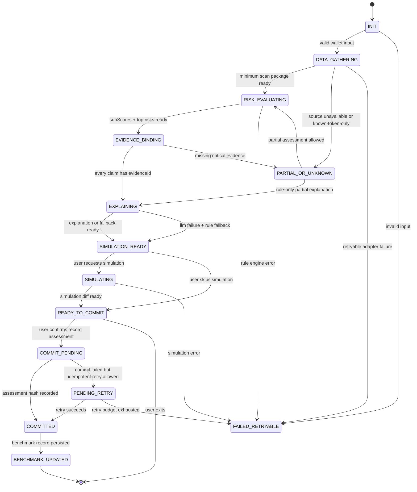

# Day 1 Agent State Machine

## Principle

The agent is a policy-bounded orchestrator. It can choose the next workflow, but risk scoring, evidence binding, simulation diff, and assessment hash are produced by deterministic modules.

## States

## Transition Guards

| From | To | Guard |
|---|---|---|
| `INIT` | `DATA_GATHERING` | Wallet address matches `0x[a-fA-F0-9]{40}` and `chainId = 5000` |
| `DATA_GATHERING` | `RISK_EVALUATING` | Native balance and at least one known-token or transfer source status is available |
| `DATA_GATHERING` | `PARTIAL_OR_UNKNOWN` | Full inventory, indexed history, or source label is unavailable |
| `RISK_EVALUATING` | `EVIDENCE_BINDING` | White-box engine returns subScores, topRisks, decisionType, and actionType |
| `EVIDENCE_BINDING` | `EXPLAINING` | Every top risk and suggested action has at least one `evidenceId` |
| `EXPLAINING` | `SIMULATION_READY` | LLM claim guard passes, or rule fallback is generated |
| `SIMULATION_READY` | `SIMULATING` | Requested action is simulation-only |
| `READY_TO_COMMIT` | `COMMIT_PENDING` | User confirms record action, `assessmentHash` exists, and `idempotencyKey` exists |
| `COMMIT_PENDING` | `COMMITTED` | Ledger adapter returns a real tx or an explicit unavailable status |

## Policy Guardrails

- One run has at most 10 agent steps.
- Same tool with the same arguments may run at most 2 times.
- Explanation retries are capped at 2.
- LLM output is rejected if it contains claims without evidence ids.
- Missing data cannot transition to a "safe" claim.
- State-changing tools require a confirmation event, trace id, and idempotency key.
- P0 state-changing tools only record assessment or outcome hashes. They do not revoke, swap, or trade.

## Required Trace Fields

Every transition writes:

- `runId`
- `traceId`
- `assessmentId` if available
- `fromState`
- `toState`
- `trigger`
- `policyDecision`
- `toolName` if applicable
- `durationMs`
- `createdAt`

## Day 1 Acceptance

- State flow contains `PARTIAL_OR_UNKNOWN`, `FAILED_RETRYABLE`, `COMMIT_PENDING`, and `COMMITTED`.
- Explanation cannot happen before risk and evidence are available.
- Commit cannot happen before assessment hash and policy confirmation.
- There is no path to real revoke, swap, or trade execution.
